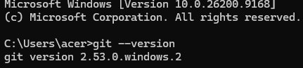
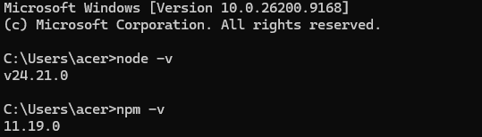
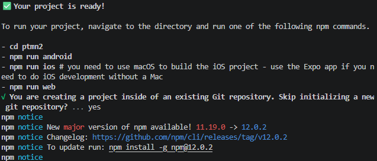
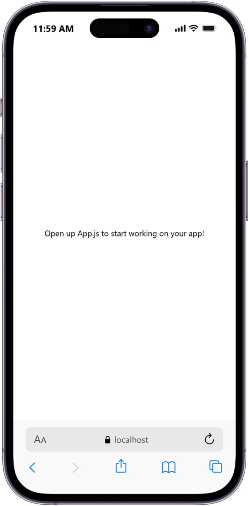
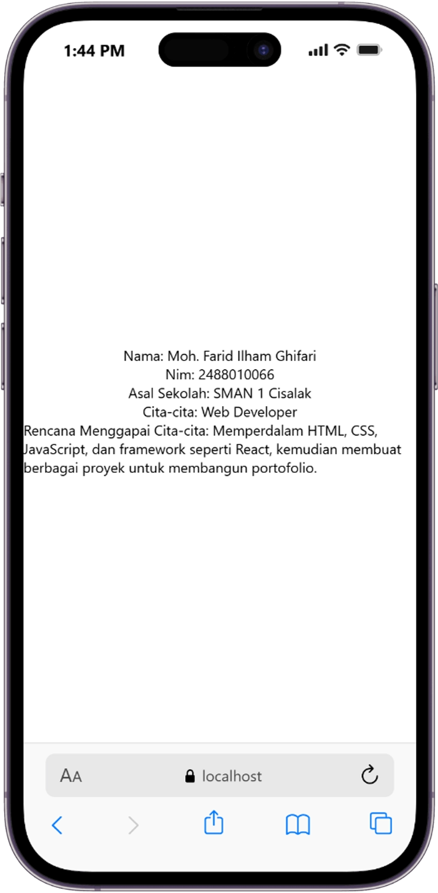

# Praktikum Menyiapkan Lingkungan Pengembangan dan Memulai Pemrograman Mobile (React Native) ##

## Tujuan Pembelajaran ##
1. Mahasiswa mampu : 
   1. Menyiapkan Lingkungan Pengembangan dan mememulai pemrograman mobile (React Native)
   2. Membuat aplikasi mobile dengan React Native
   3. Menyelesaikan Tugas CV sederhana dengan React Native

## Materi dan Laporan Praktikum ##
2. Menyiapkan Lingkungan pengembangan dan memulai pemrograman mobile
(React Native)
- Memastikan intalasi Git bash
- cek intalasi Git bash (git --version)
- bukti verifikasi

- Memastikan Node.JS dan NPM
  - Download dan install Node.JS di https://nodejs.org/en/download/
  - Konfirmasi NodeJS dan NPM(node -v, npm -v)

3. Membuat aplikasi / Projek baru dengan React Native Framework Expo Go
   - Buka dan baca dokumentasi resmi link https://docs.expo.dev/
   - Buka dan baca documentasi resmi link https://reactnative.dev/docs?getting-started
   - Memulai Membuat projek baru
   - open terminal change directory ke Pertemuan-2
   - masukan perintah (npx create-expo-app ptmn2 --template blank)
   - bukti verifikasi
   
   
   - Running Projek
     - Cd ke ptmn2
     - npx expo start
     - Install Expo Go di Android atau IOS
     - bisa juga menggunakan web emulator di Laptop / PC
     - Setelah berhentikan (ctrl + C)
     - Install (npx expo install react-dom react-native-web)
     - npx expo start --web
     - konfirmasi keberhasilan

      
4. Tugas Praktikum
   - Membuat aplikasi CV sederhana dengan React Native
   -  Nama Lengkap
   -  NIM
   -  Asal Sekolah
   -  Cita-cita
   -  Rencana Menggapai cita-cita
   -  konfirmasi keberhasilan
   
   