# Laporan Praktikum3 #

### Langkah 1: Import Library dan Components ###

...
1. Buka File App.js yang ada di folder projek ptmn2
2. Import Library dan Component yang diperlukan
3. Konfirmasi Bukti
...

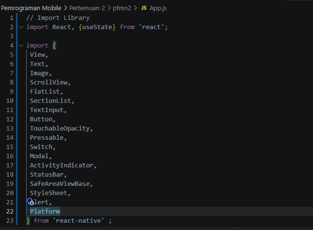

### Langkah 2: Membuat Array Objek ###

...
1. Buat Objek Array bernama PROFILE untuk wadah data profile
2. Masukan Data yang diperlukan
3. Konfirmasi Bukti
...
 
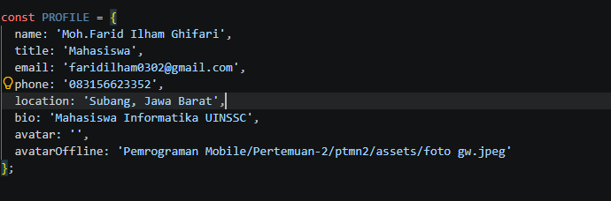
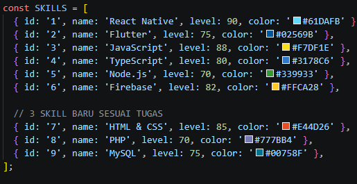
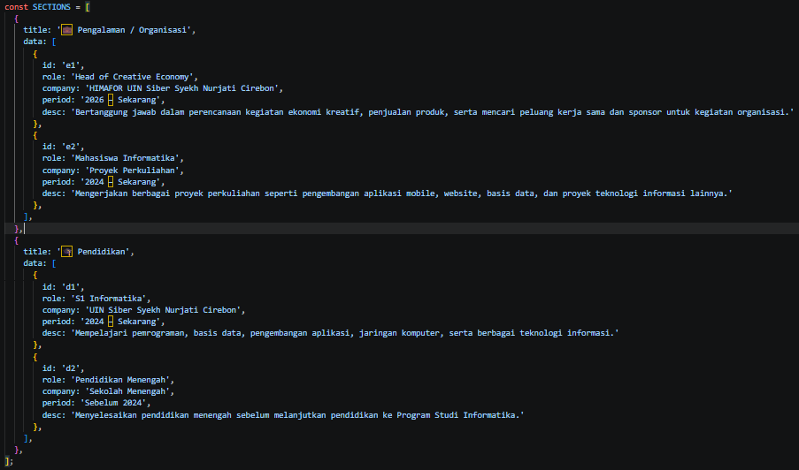

### LANGKAH 3: Sub-Components (SkillCard & TimelineCard) ###

...

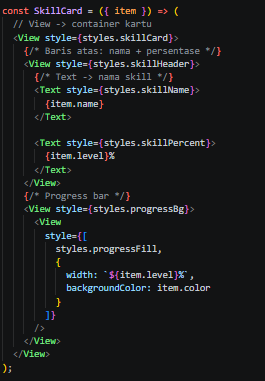
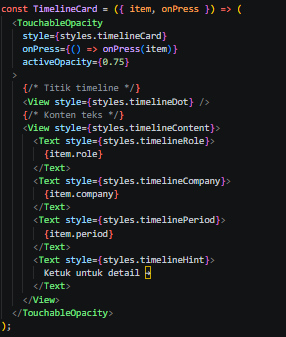

...

### LANGKAH 4: State Management dengan useState ###

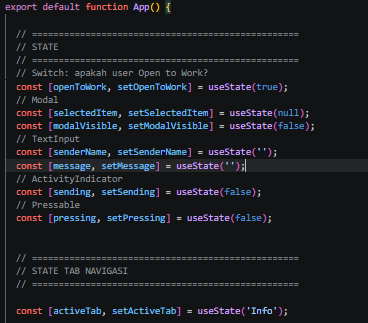

### LANGKAH 5: SafeAreaView, StatusBar & Header ###

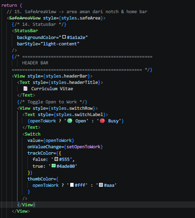

### LANGKAH 6: ScrollView & Profil Section (View, Text, img/image) ###

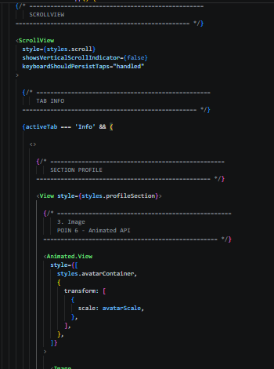
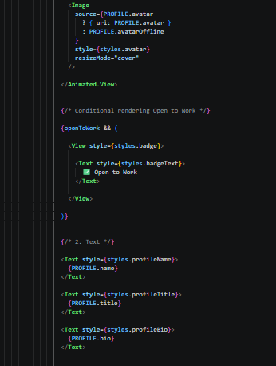
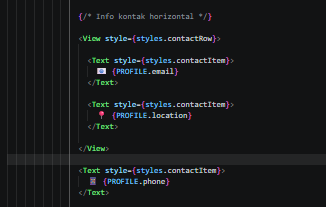

### LANGKAH 7: FlatList (Daftar Skills) ###

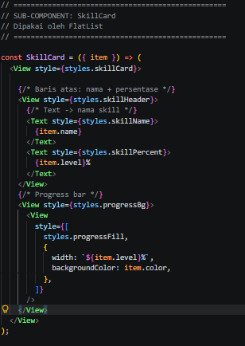

### LANGKAH 8: SectionList (Pengalaman & Pendidikan) ###

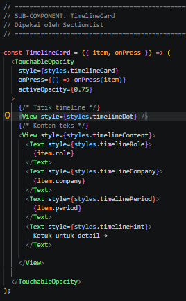

### LANGKAH 9: TextInput, Button & ActivityIndicator ###

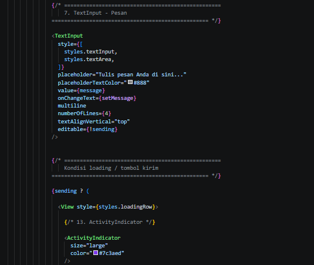
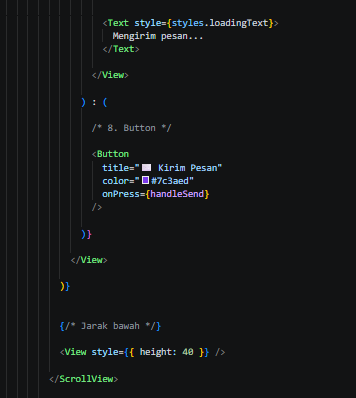

### LANGKAH 10: Modal (Popup Detail) ###

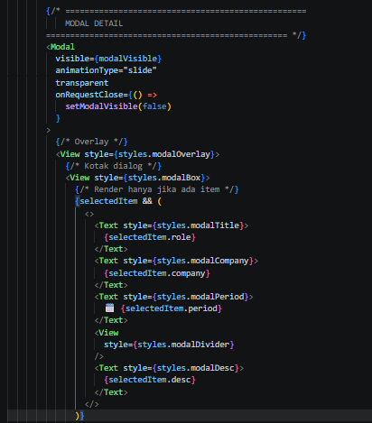
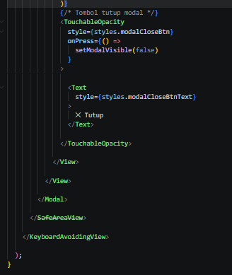

### LANGKAH 11: StyleSheet (Styling Terpusat) ###

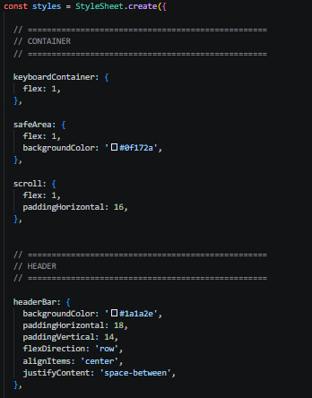

### ✅ LANGKAH 12: Verifikasi & Pengujian ###
Jalankan aplikasi dan pastikan semua fitur bekerja:

| # | Yang Diuji | Hasil yang Diharapkan |
|---|---|---|
| 1 | Aplikasi bisa dibuka | Layar CV tampil tanpa error |
| 2 | Foto profil tampil | Gambar dari URL terload |
| 3 | Halaman bisa di-scroll | Semua section bisa diakses |
| 4 | Toggle Switch | Badge "Open to Work" muncul/hilang |
| 5 | Progress bar skill | Bar berwarna sesuai persentase |
| 6 | Ketuk kartu riwayat | Modal popup muncul dari bawah |
| 7 | Tombol Tutup di Modal | Modal tertutup |
| 8 | Isi form & kirim | Loading 2 detik → Alert sukses |
| 9 | Kirim dengan input kosong | Alert peringatan muncul |
| 10 | Tekan Download CV | Efek visual berubah + Alert |
| 11 | Tap tombol sosmed | Alert URL muncul |

---
## STEP 4 ##
...

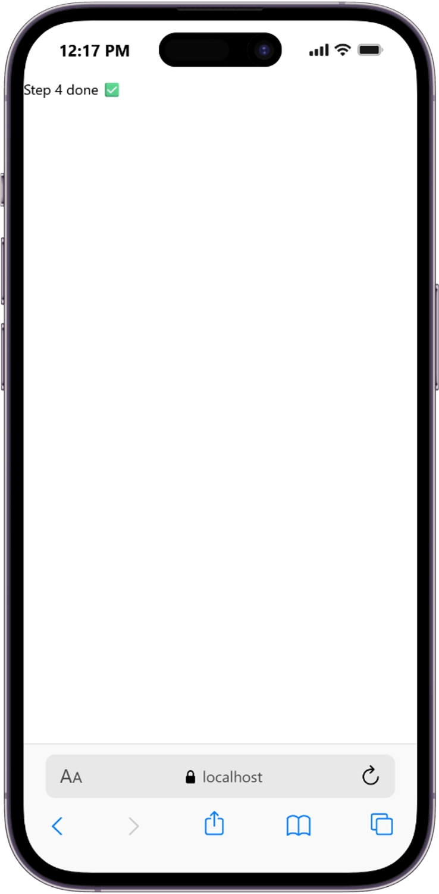

...

## Tugas Pengembangan ##

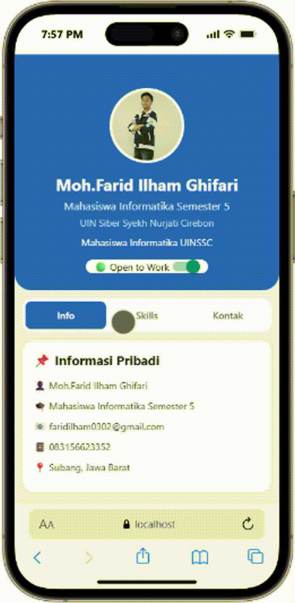 