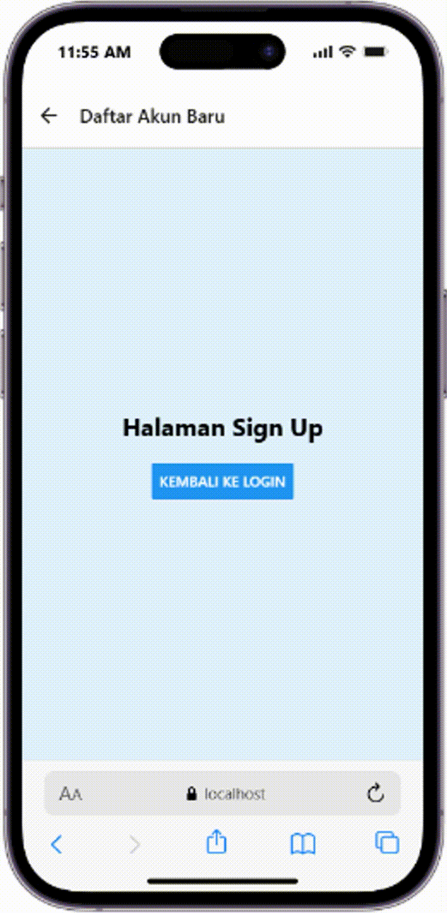
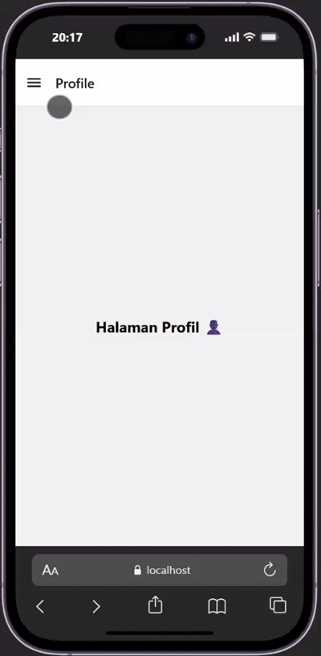

y# Praktikum 4: React Native Navigation #

## Tujuan Pembelajaran ##
Mahasiswa mampu: 
1. Merancang dan menerapkan navigasi antar layar (screen) pada aplikasi React Native
2. Menggunakan library React Navigation (Stack Navigator, Tab Navigator, Drawer Navgator)

## Alur Praktikum ##

## Langkah 1: Inisialisasi Proyek React Native ##
1. Buka terminal atau command prompt 
2. Ubah direktori ke Folder Pertemuan 4 (cd "Pemrograman Mobile\Pertemuan-4")
3. Buat proyek baru menggunakan perintah berikut: npx create-expo-app ptnm4 --template blank
4. Masuk ke dalam folder proyek menggunakan perintah berikut: cd ptnm4
5. Install core navigation library (npm install @react-navigation/native)
6. Install dependensi pendukung (wajib untuk Expo) npx expo install react-native-screens react-native-safe-area-context react-native-gesture-handler react-native-reanimated

## Langkah 2: Membuat Stack Navigator ##
1. Instalasi Pustaka Stack : npm install @react-navigation/native-stack
2. Buat Folder didalam projek dengan nama screens
3. didalam folder screens buat 2 file dengan nama Login.js dan Signup.js
4. Masukan Kode sesuai pada Modul Praktikum 4
5. Sesuaikan file App.js dengan kode yang ada pada modul.
6. Simpan dan Install dependensi untuk web npx expo install react-dom react-native-web
7. Jalankan Perintah npx expo start --web lalu tekan w pada terminal untuk membuka aplikasi di web browser.
8. Konfirmasi Bukti 

 

## Langkah 3: Membuat Bottom Navigator ##
1. Instalasi Pustaka Bottom Tabs npm install @react-navigation/bottom-tabs
2. Membuat Layar Baru : Buat file HomeScreen.js dan ProfileScreen.js di dalam folder screens.
3. Konfigurasi Tab di App.js
4. Konfirmasi Bukti

## Langkah 4: Membuat Drawer Navigator ##
1. Instalasi Pustaka Drawer npm install @react-navigation/drawer
2. Konfigurasi Drawer di App.js: Ubah kembali file App.js untuk mencoba Drawer Navigation menggunakan layar Home dan Profile yang sudah dibuat sebelumnya:
4. Catatan Penting: Geser layar dari kiri ke kanan pada emulator Anda untuk memunculkan menu Drawer.
5. Konfirmasi Bukti

